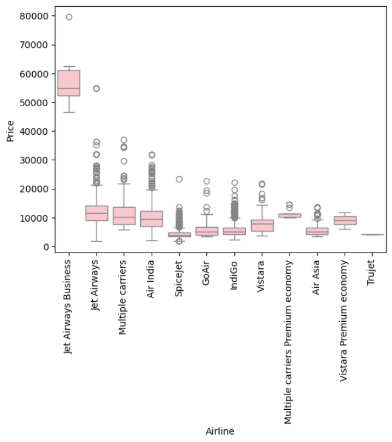

# Airlines Tickets Fare Prediction using Machine Learning

This project focuses on predicting airline ticket prices based on various factors such as departure time, arrival time, and the number of stops. The project includes data cleaning, feature engineering, outlier detection, and model building using machine learning techniques.

## Project Structure

- **Data Cleaning and Feature Extraction**: Involves preprocessing the dataset and extracting important features like duration, number of stops, and parts of the day for flights.
- **Outlier Detection**: Detecting and handling outliers to improve model performance.
- **Model Building**: Using Random Forest Regressor for predicting airline ticket prices.

## Dataset

The dataset used in this project is `Data_Train.xlsx`, which contains information on flights, including the airline, source, destination, duration, and ticket prices.

### Key Features

- `Airline`: The airline operating the flight.
- `Source`: The departure location.
- `Destination`: The arrival location.
- `Total_Stops`: The number of stops during the flight.
- `Price`: The ticket price.

## Data Cleaning and Preprocessing

1. **Loading the Data**:
    ```python
    import pandas as pd
    flight_data = pd.read_excel('Data_Train.xlsx')
    flight_data.head()
    ```

2. **Handling Missing Values**:
    - Identifying and dropping rows with null values.
    ```python
    flight_data.dropna(inplace=True)
    ```

3. **Feature Extraction**:
    - Extracting date, month, and year from the `Date_of_Journey` column.
    - Creating new columns for flight departure and arrival hours and minutes.
    ```python
    data["Journey_day"] = data['Date_of_Journey'].dt.day
    data["Journey_month"] = data['Date_of_Journey'].dt.month
    ```

4. **Data Visualization**:
    - Visualizing the distribution of flights across different times of the day.
    ```python
    data['Dep_Time_hour'].apply(flight_parts_of_day).value_counts().plot(kind='bar')
    plt.show()
    ```

## Flight Parts of Day


## Data Analysis

1. **Airline vs Price**:
    ```python
    sns.boxplot(x="Airline", y= "Price", data = data.sort_values("Price", ascending = False), color="pink")
    plt.xticks(rotation = 90)
    plt.show()
    ```

## Airline vs Price



2. **Duration vs Price**:
    ```python
    sns.scatterplot(x="Duration_total_minutes", y="Price", hue="Total_Stops", data=data)
    plt.show()
    ```

## Duration vs Price


## Outlier Detection

Outliers can distort the model and reduce its predictive accuracy. To handle outliers, we first detect them using the Interquartile Range (IQR) method.

### Logic

1. **Calculate IQR**:
    - The IQR is the range between the 25th percentile (Q1) and the 75th percentile (Q3).
    ```python
    q1 = data["Price"].quantile(0.25)
    q3 = data["Price"].quantile(0.75)
    IQR = q3 - q1
    ```

2. **Define Limits for Outliers**:
    - Any price value below `Q1 - 1.5 * IQR` or above `Q3 + 1.5 * IQR` is considered an outlier.
    ```python
    maximum = q3 + 1.5 * IQR
    minimum = q1 - 1.5 * IQR
    outliers = [price for price in data["Price"] if price > maximum or price < minimum]
    ```

3. **Handling Outliers**:
    - Outliers are replaced with the median price to avoid skewing the model's results.
    ```python
    data['Price'] = np.where(data["Price"].isin(outliers), data['Price'].median(), data["Price"])
    ```

4. **Visualizing Outliers**:
    - We use boxplots and distribution plots to visualize the outliers before and after handling them.
    

## Outlier Detection
#### Before handling outliers
 

#### After handling outliers


## Model Building

1. **Train-Test Split**:
    - Splitting the dataset into training and testing sets.
    ```python
    from sklearn.model_selection import train_test_split
    X_train, X_test, y_train, y_test = train_test_split(X, y, test_size=0.25, random_state=42)
    ```

2. **Random Forest Regressor**:
    - Training the Random Forest model on the training set.
    ```python
    from sklearn.ensemble import RandomForestRegressor
    ml_model_rf = RandomForestRegressor()
    ml_model_rf.fit(X_train, y_train)
    ```

3. **Model Evaluation**:
    - Evaluating model performance using R-squared, MAE, MSE, RMSE, and MAPE.
    ```python
    from sklearn import metrics
    metrics.r2_score(y_test, y_pred)
    ```

4. **Saving the Model**:
    - Saving the trained Random Forest model using `pickle`.
    ```python
    import pickle
    file = open('rf_random.pkl','wb')
    pickle.dump(ml_model_rf, file)
    ```

## Model Evaluation Metrics


## Usage

1. **Run the model**:
    ```python
    model = open('rf_random.pkl','rb') 
    forest = pickle.load(model)
    forest.predict(X_test)
    ```

